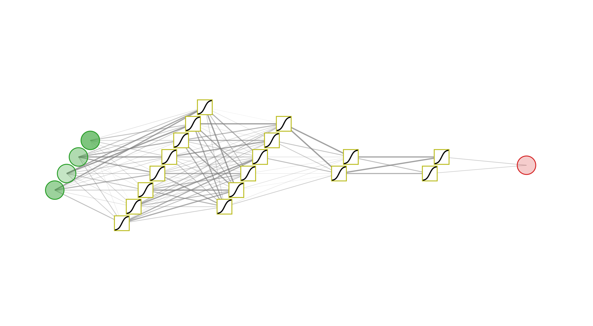

# Neural Network Visualizer

An interactive, browser-based tool for visualizing neural network architectures. Create publication-ready diagrams for MLPs, ResNets, and Neural ODEs.

## Features

- **Multiple Architectures**: MLP, ResNet (with skip connections), Neural ODE
- **Customizable Appearance**:
  - Neuron colors (state, hidden, input, output, connections)
  - Neuron shapes (circle, square, diamond, triangle)
  - Activation function plots inside hidden neurons
  - Adjustable radius, spacing, and network dimensions
- **3D Perspective**: Tilt and mirror effects
- **Real Computation**: Forward pass visualization with opacity-based magnitude display
- **Export**: SVG, PNG, and PDF formats

## Usage

Simply open `NN-visualizer.html` in a web browser. No installation required.

### Controls

| Control | Description |
|---------|-------------|
| Network Type | MLP, ResNet, or Neural ODE |
| Spacing / Tilt | Adjust layer spacing and 3D perspective |
| Skip Curve | Control curvature of residual connections |
| Neuron Radius | Size of neurons (positions stay fixed) |
| Network Length/Height | Horizontal and vertical spread |
| Colors | Customize all element colors |
| Shapes | Circle, square, diamond, or triangle for neurons |

### ResNet Formula

The residual blocks follow: $x_{\ell+1} = x_\ell + \sum_{i=1}^{p} w_i \, \sigma(a_i^\top x_\ell)$

## Export

- **SVG**: Vector format, ideal for editing
- **PNG**: High-resolution raster (3x scale)
- **PDF**: Publication-ready (~5-15MB)

## Dependencies

Loaded via CDN (no local installation):
- D3.js v7
- jsPDF 2.5.1

## License

MIT
